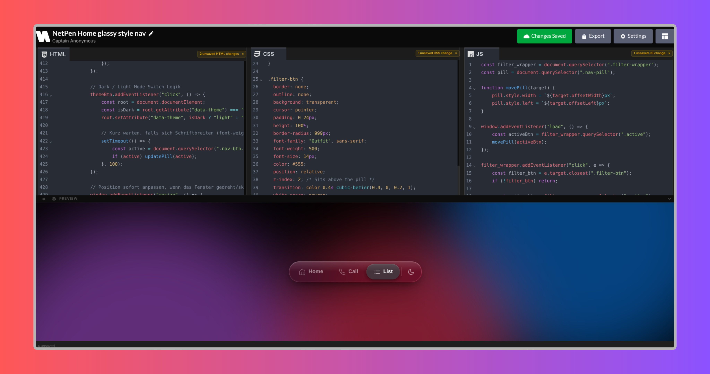

<p align="center">
  <a href="https://doodlecode-editor.vercel.app/">
    
  </a>
</p>

<h1 align="center">Doodlecode Editor</h1>

<p align="center">
  <strong>Write. Preview. Export. All in real-time.</strong><br/>
  A lightweight, zero-setup live code playground for HTML, CSS, and JavaScript.
</p>

<p align="center">
  <a href="./LICENSE">
    
  </a>
  
  
  
  
  
  
  
  
  
</p>

<p align="center">
  <a href="https://doodlecode-editor.vercel.app">
    
  </a>
</p>


# About Doodlecode Editor

**Doodlecode Editor** is a free, open-source live coding environment for HTML, CSS, and JavaScript. Write code inside three synchronized editors and watch your changes appear instantly in the live preview without saving, refreshing, or configuring anything.

Whether you're prototyping a UI, testing snippets, teaching web development, or building a quick landing page, doodlecode editor provides a clean, distraction-free workspace designed to keep you focused on writing code.

Unlike many online playgrounds that are slow, cluttered, or locked behind subscriptions, doodlecode editor focuses on speed and simplicity.

- **Instant Preview** · Render changes in real time as you type.
- **Clean Interface** · Minimal UI with zero distractions.
- **Auto Save** · Everything is stored automatically in your browser's `localStorage`.
- **Flexible Export** · Export HTML, CSS, JavaScript, ZIP archives, or a standalone HTML file.

Whether you're just starting web development or rapidly testing production ideas, doodlecode editor adapts to your workflow instead of getting in the way.


# Features

- **Live Editors** · HTML, CSS, and JavaScript editors powered by CodeMirror 6 with syntax highlighting, autocomplete, bracket matching, and line numbers.
- **Customization** · Four editor themes, multiple layout modes, adjustable font settings, and responsive workspace layouts.
- **Live Preview** · Instant rendering with automatic background adaptation and fullscreen preview support.
- **Export** · Download individual files, a combined HTML file, or a ZIP archive with optional comment removal and code minification.
- **Smart Saving** · Debounced auto-save with dynamic save status and complete project persistence in `localStorage`.
- **Project Management** · Rename projects at any time with filenames updating automatically during export.
- **Responsive Experience** · Optimized layouts for desktop, tablet, and mobile devices.

# Architecture

Doodlecode editor is built around a clear separation between the editing engine, state management, and the user interface.

Instead of tightly coupling the editors with the preview or export system, the application centralizes code management through custom React hooks and a shared state store. Each editor maintains its own source code while the preview automatically subscribes to changes and updates in real time. This architecture keeps the project predictable, maintainable, and easy to extend.

The entire application runs locally inside the browser without relying on external APIs or server-side processing. All source code, editor preferences, layouts, and project settings are automatically persisted using a debounced `localStorage` save mechanism, allowing projects to survive page refreshes and browser restarts.

Doodlecode editor is a single-page application, with layout switching handled entirely through React state rather than client-side routing.


# Extending Doodlecode Editor

Adding new functionality is intentionally straightforward thanks to the modular architecture.

## Add a New Editor Language

1. Add a new CodeMirror language extension inside `CodeEditor.tsx`.
2. Register the extension in the `languageExtensions` object.
3. (Optional) Add a new editor tab inside `App.tsx`.

The new language immediately becomes available without requiring additional configuration.

---

## Add a New Export Format

1. Create a new export function inside `src/utils/export.ts` (or directly in `ExportPanel.tsx`).
2. Add a new export button or menu option.
3. Connect the new option to the export handler.

The export system already supports:

- HTML
- CSS
- JavaScript
- Combined HTML
- ZIP Archive

Additional formats such as JSON or Markdown can be added following the same pattern.
# Project Structure

The project follows a modular React architecture where each part of the application has a clear responsibility.

```text
doodlecode-editor
├── public
├── src
│   ├── assets
│   ├── components
│   │   ├── editor
│   │   ├── export
│   │   ├── layout
│   │   ├── preview
│   │   ├── settings
│   │   └── ui
│   ├── context
│   ├── hooks
│   ├── lib
│   ├── types
│   ├── App.tsx
│   ├── main.tsx
│   └── index.css
├── package.json
└── vite.config.ts
```


# Directory Overview

- **`components/editor/`** · CodeMirror editors and editor-related components.
- **`components/export/`** · Export panel and download utilities.
- **`components/layout/`** · Header, footer, and project name editor.
- **`components/preview/`** · Live preview and resizable preview drawer.
- **`components/settings/`** · Theme, editor, and layout settings.
- **`components/ui/`** · Shared reusable UI components.
- **`context/`** · Global settings and application state.
- **`hooks/`** · Custom React hooks including debouncing utilities.
- **`lib/`** · Default templates, layout helpers, and shared utilities.
- **`types/`** · Shared TypeScript type definitions.


# Design Principles

- **Instant Feedback** · Every keystroke updates the preview immediately.
- **Client-Side Processing** · Everything runs entirely inside the browser.
- **Persistent State** · Projects and preferences are automatically saved to `localStorage`.
- **Reusable Components** · Modular React components improve consistency and maintainability.
- **Extensible Architecture** · New editors, themes, layouts, and export options can be added with minimal changes.


# Performance

- **CodeMirror 6** · Fast editor with incremental parsing and efficient rendering.
- **Debounced Auto-Save** · Reduces unnecessary storage writes while preserving work.
- **Memoized Components** · Minimizes unnecessary re-renders throughout the interface.
- **Client-Side Rendering** · Zero network requests while editing and previewing.


# Built With

Doodlecode editor is powered by a modern frontend stack focused on speed, maintainability, and developer experience.

- React
- Vite
- Tailwind CSS v4
- TypeScript
- CodeMirror 6
- Lucide React
- React Icons
- JSZip

<p align="left">
  
</p>

# Getting Started

## Requirements

- Node.js (Latest LTS)
- npm or Yarn
- Modern browser (Chrome, Edge, Firefox, or Safari)

## Quick Setup

```bash
git clone https://github.com/byllzz/doodlecode-editor.git
cd doodlecode-editor
npm install
npm run dev
```

Open the local development URL displayed in your terminal.

## Production Build

```bash
npm run build
npm run preview
```


# Contributing

Contributions of every size are welcome.

Whether you're fixing a typo, improving accessibility, adding a new editor theme, optimizing performance, or introducing an entirely new feature, every contribution helps make Doodlecode editor better.

Before opening a pull request, take a moment to understand how the editor configuration and export system are organized. Thanks to the modular architecture, most new features only require a small amount of code.


## Adding a New Editor Theme

1. Add the theme configuration inside `src/context/SettingsContext.tsx`.
2. Register the theme in the `themes` array inside `SettingsPanel.tsx`.
3. The theme automatically becomes available across all editors.


## Adding a New Export Option

1. Add the export function inside `ExportPanel.tsx`.
2. Create a new export button or menu option.
3. Connect the option to the export handler.

The export system will automatically include the new format once registered.
# Author

<p align="left">
  
</p>

## Bilal Malik

<p>
  <a href="https://github.com/byllzz">
    
  </a>
  <a href="https://x.com/bilalmlkdev">
    
  </a>
  <a href="https://linkedin.com/in/bilalmalik">
    
  </a>
</p>

---

If you enjoyed this project, consider giving it a ⭐ on GitHub. It helps others discover the project and supports future improvements.

<p align="right">
  <a href="#doodlecode-editor">⬆ Back to Top</a>
</p>


# License

This project is licensed under the **MIT License**.

```text
MIT License

Copyright (c) 2026 Bilal Malik

Permission is hereby granted, free of charge, to any person obtaining a copy
of this software and associated documentation files (the "Software"), to deal
in the Software without restriction, including without limitation the rights
to use, copy, modify, merge, publish, distribute, sublicense, and/or sell
copies of the Software, and to permit persons to whom the Software is
furnished to do so, subject to the following conditions:

The above copyright notice and this permission notice shall be included in all
copies or substantial portions of the Software.

THE SOFTWARE IS PROVIDED "AS IS", WITHOUT WARRANTY OF ANY KIND, EXPRESS OR
IMPLIED, INCLUDING BUT NOT LIMITED TO THE WARRANTIES OF MERCHANTABILITY,
FITNESS FOR A PARTICULAR PURPOSE AND NONINFRINGEMENT. IN NO EVENT SHALL THE
AUTHORS OR COPYRIGHT HOLDERS BE LIABLE FOR ANY CLAIM, DAMAGES OR OTHER
LIABILITY, WHETHER IN AN ACTION OF CONTRACT, TORT OR OTHERWISE, ARISING FROM,
OUT OF OR IN CONNECTION WITH THE SOFTWARE OR THE USE OR OTHER DEALINGS IN THE
SOFTWARE.
```

<p align="left">
  © 2026 Doodlecode Editor. Licensed under the MIT License.
</p>
